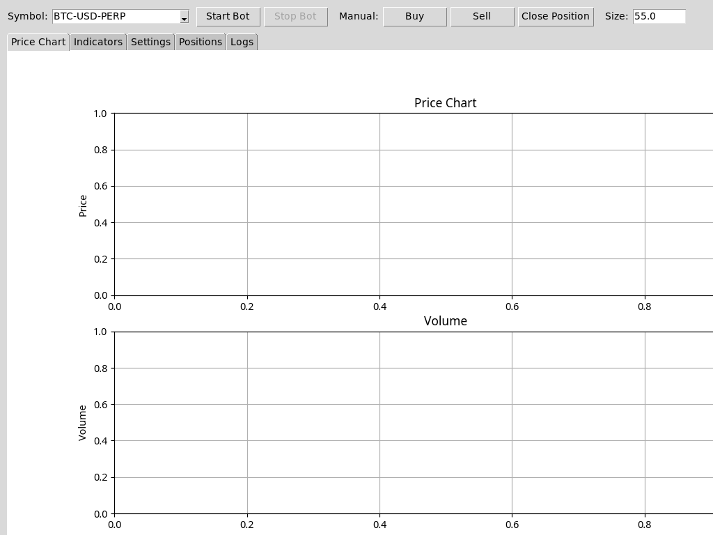

"""
README for Enhanced Hyperliquid Trading Bot

A comprehensive, AI-powered cryptocurrency trading bot for the Hyperliquid exchange.
"""

# Enhanced Hyperliquid Trading Bot



*Screenshot of the Enhanced Hyperliquid Trading Bot GUI showing the price chart interface, trading controls, and configuration options.*

## Overview

This enhanced trading bot builds upon the original Hyperliquid trading system with advanced features:

- **Triple Confluence Strategy**: Combines funding edge, order book imbalance, and technical triggers
- **Oracle Update Trading**: Capitalizes on Hyperliquid's 3-second oracle update cycle
- **AI-Powered Sentiment Analysis**: Uses LLMs to analyze market sentiment and narratives
- **Advanced Risk Management**: Dynamic position sizing, circuit breakers, and drawdown protection
- **Robust Error Handling**: Comprehensive error recovery and fallback mechanisms
- **Configuration Compatibility**: Seamless migration from original bot configuration

## Directory Structure

```
enhanced_bot/
├── core/                      # Core components
│   ├── hyperliquid_adapter.py # Exchange interface
│   ├── error_handler.py       # Error handling and recovery
│   └── ...
├── sentiment/                 # Sentiment analysis
│   ├── llm_analyzer.py        # LLM-based sentiment analyzer
│   └── ...
├── strategies/                # Trading strategies
│   ├── triple_confluence.py   # Triple Confluence strategy
│   ├── oracle_update.py       # Oracle Update strategy
│   └── ...
├── main.py                    # Main application entry point
├── config_compatibility.py    # Configuration compatibility layer
├── integration_test.py        # Integration testing
├── requirements.txt           # Dependencies
└── user_guide.md              # Comprehensive user guide
```

## Quick Start

1. **Install dependencies**:
   ```bash
   pip install -r requirements.txt
   ```

2. **Configure the bot**:
   ```bash
   python config_compatibility.py
   ```

3. **Test the installation**:
   ```bash
   python integration_test.py
   ```

4. **Run the bot**:
   ```bash
   python main.py
   ```

## Documentation

For complete setup, configuration, and usage instructions, please refer to the [User Guide](user_guide.md).

## Features

### Advanced Trading Strategies

- **Triple Confluence Strategy**: Requires three separate conditions to align before entering a trade:
  1. Funding Edge: Trade in direction that collects funding
  2. Order Book Edge: Minimum 1.3 order imbalance ratio
  3. Technical Trigger: VWMA crossover, hidden divergence, or liquidity sweep

- **Oracle Update Trading**: Capitalizes on Hyperliquid's 3-second oracle update cycle to capture price inefficiencies between market price and oracle price.

### AI-Powered Sentiment Analysis

- Uses Large Language Models to analyze news, social media, and market narratives
- Adjusts trading signals based on sentiment and confidence
- Supports both OpenAI API and local LLM deployment

### Robust Risk Management

- Dynamic position sizing based on volatility and account equity
- Circuit breakers to pause trading after consecutive losses
- Maximum drawdown protection
- Tiered stop-loss and take-profit levels

### Error Handling and Recovery

- Comprehensive error categorization and recovery strategies
- Rate limiting and retry mechanisms
- Fallback options for critical operations

## Compatibility

This enhanced bot maintains compatibility with the original Hyperliquid trading bot configuration. Existing `config.json` files will be automatically migrated to the new format while preserving all original settings.

## Requirements

- Python 3.8 or higher
- Hyperliquid account with API access
- Internet connection
- 2GB RAM minimum (4GB recommended)

## Disclaimer

This software is for educational and informational purposes only. Cryptocurrency trading involves significant risk. Use this bot at your own risk. The developers are not responsible for any financial losses incurred through the use of this software.

## License

This project is licensed under the MIT License - see the LICENSE file for details.
